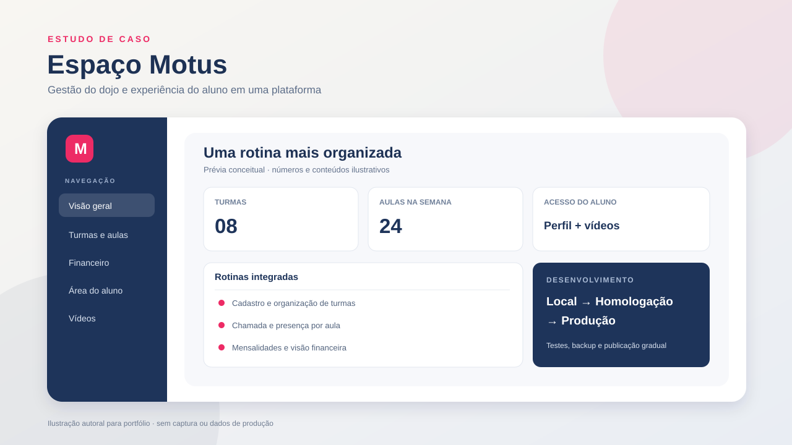

# Espaço Motus — estudo de caso

**Um sistema de gestão para a rotina de um dojo, com área administrativa e experiência para alunos.** Este repositório apresenta o projeto, as decisões de desenvolvimento e as validações realizadas. A aplicação em produção, seus dados e seu código-fonte integral permanecem privados.

> Visual acima criado para este portfólio. Os dados e números exibidos são fictícios; não é uma captura da produção.

## O produto

O Espaço Motus reúne atividades que antes exigiam várias consultas e controles separados:

| Rotina | O que a plataforma oferece |
| --- | --- |
| Organização | Cadastros de alunos, unidades, turmas, períodos e papéis de acesso. |
| Aulas | Grade e lista de chamada com presença registrada por data. |
| Financeiro | Geração de mensalidades, contas a receber e a pagar, baixas parciais e fluxo de caixa. |
| Área do aluno | Perfil e vídeos didáticos organizados em categorias e subcategorias. |
| Operação | Interface responsiva, temas claro e escuro e navegação condicionada às permissões. |

O sistema combina PHP e MySQL/MariaDB com o Adianti Framework/Template. Minha atuação neste estudo de caso cobre a evolução das regras de negócio e da interface, a organização do desenvolvimento em Git, os roteiros de teste e a publicação gradual. O Adianti é uma tecnologia de terceiros; este portfólio não o redistribui nem reivindica sua autoria.

## Problemas de engenharia que enfrentei

1. **Recebimentos parciais:** registrar cada pagamento com valor e data, preservando o saldo do título e evitando inventar parcelas de registros antigos sem histórico detalhado.
2. **Fluxo de caixa:** separar a previsão por vencimento da visualização de valores já pagos, mantendo os cálculos consistentes entre telas e relatórios.
3. **Uso no celular:** tornar grades largas acessíveis dentro de cada painel, sem cortar colunas nem alargar a página inteira.
4. **Evolução de um sistema existente:** concentrar os ajustes na aplicação e preservar o núcleo do framework.
5. **Publicação segura:** validar em ambiente local e homologação antes de publicar, com backup, conferência dos arquivos alterados e preservação de fotos e uploads.

Veja [as decisões técnicas](docs/decisoes-tecnicas.md), [a arquitetura em alto nível](docs/arquitetura.md) e [as evidências de validação](docs/validacao.md).
Novos materiais seguem os [critérios de publicação](docs/publicacao.md).

## Demonstração

O [roteiro de demonstração](docs/roteiro-demo.md) percorre as principais funções em aproximadamente 70 segundos. A gravação deve usar exclusivamente contas e dados fictícios. Um vídeo demonstrativo poderá ser adicionado aqui depois de revisado para publicação.

## O que este repositório contém

Documentação autoral, um diagrama e uma ilustração criados para o portfólio. **Não contém** o código da aplicação, o Adianti, banco de dados, credenciais, fotos de alunos, comprovantes, arquivos de produção ou histórico do repositório privado. Este material não é instalável e não permite reconstruir o sistema diretamente.

O repositório público é independente do repositório de desenvolvimento. Uma análise do código completo pode ser conversada individualmente, conforme a autorização de acesso aplicável.

## English overview

Espaço Motus is an operational platform for a martial-arts school. This case study covers attendance, recurring fees, partial payments, cash-flow views, student content, responsive UI, quality checks and staged deployment. The production application and its source code remain private.

## Créditos e uso

Estudo de caso elaborado por Vanderlei Pacheco Filho sobre o trabalho realizado para o Espaço Motus. A aplicação utiliza Adianti Framework/Template, tecnologia de terceiros não incluída neste repositório. O nome e a marca Espaço Motus identificam o projeto; sua inclusão aqui não concede licença sobre o sistema, a marca ou materiais de terceiros.

Este repositório não adota uma licença de código aberto nem concede permissão para redistribuir seus textos e ilustrações fora das funcionalidades permitidas pelo GitHub. A visibilidade pública não impede cópias técnicas; por isso, o código e os materiais operacionais do sistema não são publicados aqui.
