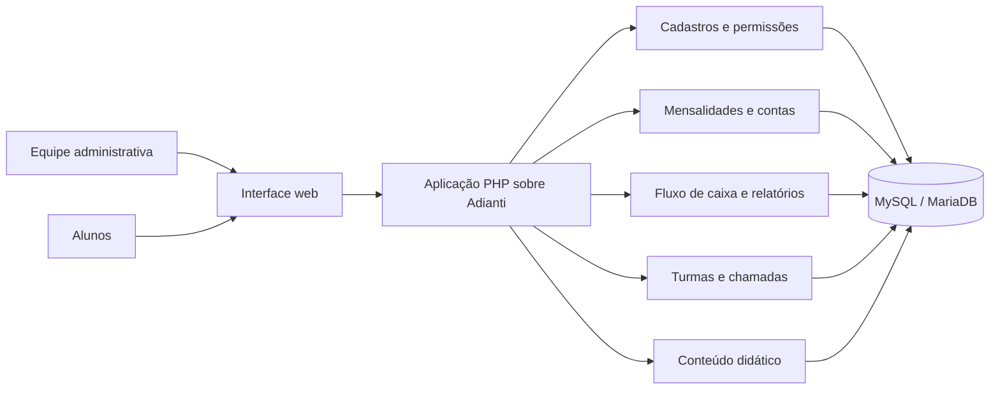

# Arquitetura em alto nível

Este desenho descreve responsabilidades do produto, sem divulgar configurações, endpoints internos ou código operacional.

## Separação de responsabilidades

- O framework fornece a estrutura da aplicação. Regras e telas específicas do Motus são mantidas na camada própria do projeto.
- Perfis de acesso determinam quais rotinas e atalhos cada usuário pode utilizar.
- A área financeira distingue o vencimento previsto dos movimentos efetivamente pagos.
- A presença é associada à turma e à data da aula; vídeos didáticos são organizados por categoria.
- Ambientes local, homologação e produção são usados em sequência. Dados fictícios ficam no QA; produção recebe apenas verificações sem gravação.

Este é um resumo conceitual: não é documentação de instalação nem um mapa completo da infraestrutura.
